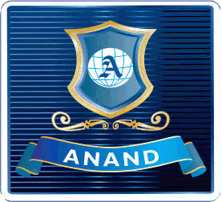
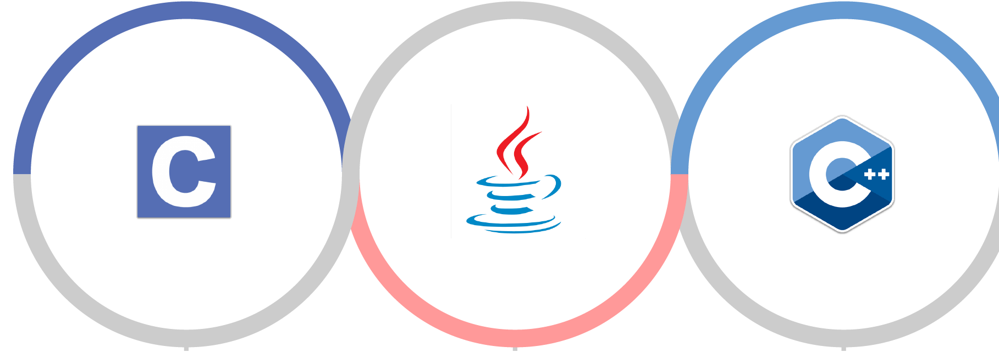
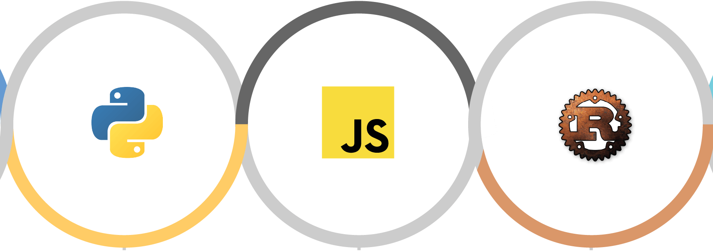

<!DOCTYPE html>
<html lang="en">
<head>
	<meta charset="utf-8">
	<title>ANAND - Online quiz contest</title>
    <meta name="viewport" content="width=device-width, initial-scale=1.0">
	<meta name="keywords" content="some keywords that best describe your business">
	<meta name="description" content="a short description of your company">
	<meta name="author" content="SRPACDY">

	<!-- Mobile Specific Metas
	================================================== -->
	<meta name="viewport" content="width=device-width, initial-scale=1, maximum-scale=1">

	<!-- CSS
	================================================== -->
	<link rel="stylesheet" href="css/bootstrap.css" type="text/css" media="screen">
	<link rel="stylesheet" href="css/bootstrap-theme.css" type="text/css" media="screen">
	<link rel="stylesheet" href="css/layout.css" type="text/css" media="screen">
	<link rel="stylesheet" href="css/background.css" type="text/css" media="screen">
	<link rel="stylesheet" href="css/font-awesome.min.css" type="text/css" media="screen">
	<link rel="stylesheet" href="css/quiz.css" type="text/css" media="screen">
	
	<!-- Favicons
	================================================== -->
	<link rel="shortcut icon" href="images/anand.jpg">

</head>
<body>

	<!-- Primary Page Layout
	================================================== -->

	
	
		
<button class="myButton" id="myBtn">Rules & Regulations</button> 
			<header class="col-xs-12 text-center">
				
<strong>ANAND INTERNATIONAL COLLEGE OF ENGINEERING 
				Presents</strong> 
				<strong>PlayWithCode
				
				
				

					<ul class="time txtshadow3"> 
					<li style="font-size:34px;">STARTS IN</li> 
						<li>
							 
							<i class="full-text">Days</i>
							<i class="short-text">Day</i>
						</li>
						<li>
							 
							<i class="full-text">Hours</i>
							<i class="short-text">Hrs</i>
						</li>
						<li>
							 
							<i class="full-text">Minutes</i>
							<i class="short-text">Min</i>
						</li>
						<li>
							 
							<i class="full-text">Seconds</i>
							<i class="short-text">Sec</i>
						</li>
					</ul>
				

				

					<!--  -->
					
					
					

						A school level coding contest On June 15, 2020

					

				

				
					
					

					<h4 style="font-size:24px;">Details of Online QUIZ goes here 
					Use Below Link to Start Your Exam   </h4>
					

				

		</header>
		

		

			
REGISTRATION ENDS ON JUNE 08
				

					<a href="#register" class="smooth"><i class="fa fa-angle-down fa-3x"> REGISTER NOW </i><i class="fa fa-angle-down fa-3x"></i></a>
				

			

			
LOTS OF PRIZES
				

					<a href="#prize" class="smooth"><i class="fa fa-angle-down fa-3x"> CASH PRIZES </i><i class="fa fa-angle-down fa-3x"></i></a>
				

			

		

	

	

		

			

				

					<h2>Register Yourself by Filling the Form Below</h2>
					<iframe src="https://docs.google.com/forms/d/e/1FAIpQLSfRykQdUI-oyoo6-ZVdNNaJH1koVHP8IeMLxnnhSRTtLWczAg/viewform?embedded=true" width="100%" height="450px" frameborder="0" marginheight="0" marginwidth="0" >Loading…</iframe>
				
				
			

			

				
					
						<h3><strong>Read Instructions carefully</Strong></h3>
					

						<ol>
						<li>Instruction number one  is gone here Instruction number one  is gone here Instruction number one  is gone here Instruction number one  is gone here</li>
						<li>Instruction number two  is gone here</li>
						<li>Instruction number three  is gone here</li>
						<li>Instruction number four  is gone here</li>
						<li>Instruction number five  is gone here</li>
						<li>Instruction number one  is gone here</li>
						</ol>
					

				
				
			

		

	

	

			

				

					&times; 
						<h3>REGULATIONS</h3>
						<h4>ELIGIBILITY</h4>
						
The ______________________is open to all school students across the country, from any school board. Any student registered in school
						up to class 12th / in class 12th  Science / IT during the academic year 2019-2020 is eligible. There is no lower age limit for participation. 
						To participate, student must still be in school. If they have completed Class 12th , they are no longer eligible, even if they have taken a 
						break and are not enrolled in college, or if are planning to redo their Class 12th  exams for improvement. Students have to upload their ID 
						card at the time of registration. 
 
						<h3>PROCEDURE FOR PARTICIPATION</h3>
						<h4>REGISTRATION</h4>
						
Students have to register themselves by clicking a hyperlink, which will be provided them via the invitation / on Anand 
						International College of Engineering web site / ( The invitation may be transferable ) . They need to fill their basic details 
						with school id. 

						<h4>VALIDATION AND COMPETITION DETAIL</h4>
						
Once they fill up the form they will get a response sheet. User name , password  for appearing in the competition will be 
						provided to them once their registration found valid.

						<h4>COMPETITION RULES</h4>
						
On the date of competition, students will get a link on their respective ids . Which will take them to the coding environment 
						where they may login by entering their respective username and password .   Timer will be started for 90 Minutes quiz where 
						30 puzzles are to be solved. The competition will be held online and students can attempt sitting on their location. The judgment 
						will be automated and the event will be observed online by a senior software developer.  The automated judgment will be final.							
			

		

	

	

		

			

				
					
					<h3><strong>For the winners, cash prizes of Rs 1 lac.</Strong></h3> 
					

						

							<h4>Select any programming language,   Show your coding skills and win prizes</h4>
						

					

					

						

							<ul>
							<li>1 st - <i class="fa fa-rupee"></i>  30,000</li>
							<li>2 nd - <i class="fa fa-rupee"></i>  20,000</li>
							<li>3 rd - <i class="fa fa-rupee"></i> 15,000</li>
							<li>4 th - <i class="fa fa-rupee"></i>  12,000</li>
							<li>5 th - <i class="fa fa-rupee"></i>  10,000</li>
							<li>6 th - <i class="fa fa-rupee"></i>  08,000</li>
							<li>7 th - <i class="fa fa-rupee"></i>  05,000</li>
							</ul>
						

					

				

				

					

						<a href="#anandlogo" class="smooth"><i class="fa fa-angle-up fa-3x"> GO UP </i><i class="fa fa-angle-up fa-3x"></i></a>
					

				

			

		

	

	

		

			

				

					<h2>CONTACT PERSON'S</h2> 
					

					<h4>NEERAJ PRAKASH SHRIVASTAVA   HOS CSE   E-MAIL : neeraj.shrivastava@gmail.com   MOBILE : +91-89546789 </h4>
					

					

					<h4>ANUBHAV SEXENA   ASSISTANT PROFESSOR   E-MAIL : anubhav.saxena@gmail.com   MOBILE : +91-89546789 </h4>
					

					

						<a href="https://creativemarket.com/SRPACDY" target="_blank"><i class="fa fa-twitter fa-2x"></i></a>
						<a href="https://creativemarket.com/SRPACDY" target="_blank"><i class="fa fa-facebook fa-2x"></i></a>
						<a href="https://creativemarket.com/SRPACDY" target="_blank"><i class="fa fa-instagram fa-2x"></i></a>
						<a href="https://creativemarket.com/SRPACDY" target="_blank"><i class="fa fa-vimeo-square fa-2x"></i></a>
						<a href="https://creativemarket.com/SRPACDY" target="_blank"><i class="fa fa-tumblr fa-2x"></i></a>
						<a href="https://creativemarket.com/SRPACDY" target="_blank"><i class="fa fa-pinterest fa-2x"></i></a>	
						<a href="https://creativemarket.com/SRPACDY" target="_blank"><i class="fa fa-flickr fa-2x"></i></a>
					
					
				
				
			

		

	

	

		

			
				
				
Copyright&copy;2020 <a href="http://anandice.ac.in/" target="_blank">ANANAD ICE</a>

			
			
		

	

	<!-- JS
	================================================== -->
	
	
	
	
	
	
	
	

	<!-- End Document
	================================================== -->

</body>
</html>
